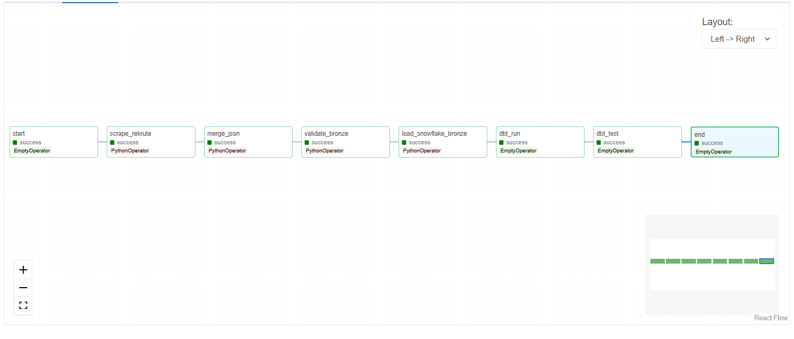
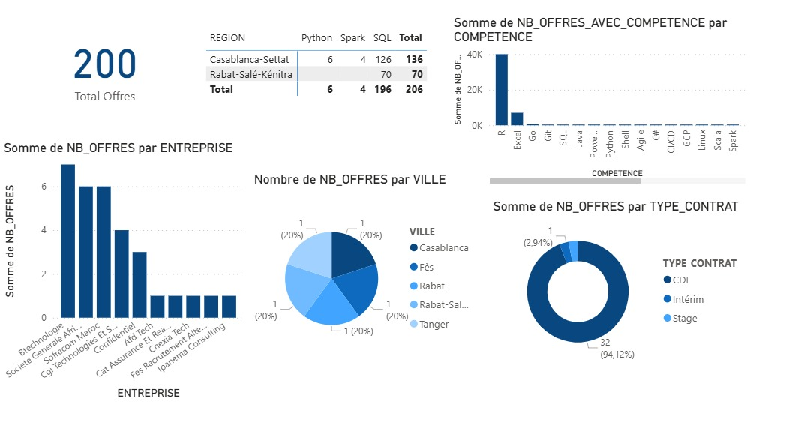

# Plateforme d'Analyse du Marché de l'Emploi au Maroc



## 📋 Description

Ce projet vise à **automatiser la collecte, le stockage, la transformation et l'analyse** des offres d'emploi tech au Maroc. Un pipeline ELT moderne extrait quotidiennement les offres depuis **rekrute.ma**, les stocke dans **Snowflake**, les transforme avec **dbt**, et les visualise dans un **dashboard Power BI**.

### Problématique
- 📌 Offres d'emploi dispersées sur plusieurs sites  
- 📌 Pas de vision centralisée sur les compétences recherchées  
- 📌 Difficulté à suivre les tendances (villes, contrats, salaires)  
- 📌 Aucune analyse automatisée du marché tech marocain  

### Objectifs
- ✅ Centraliser automatiquement les offres d'emploi tech  
- ✅ Nettoyer et standardiser les données  
- ✅ Extraire des tendances (compétences, villes, contrats)  
- ✅ Visualiser les résultats dans un dashboard interactif  

---

## 🏗️ Architecture

### Stack technique

| Catégorie        | Technologie              | Rôle |
|------------------|--------------------------|------|
| **Scraping**     | Python + BeautifulSoup  | Extraction des offres |
| **Orchestration**| Apache Airflow (Docker) | Automatisation quotidienne |
| **Stockage**     | Snowflake               | Data Warehouse (Bronze/Silver/Gold) |
| **Transformation**| dbt                    | Nettoyage et modélisation SQL |
| **Visualisation**| Power BI                | Dashboard interactif |

### Pipeline ELT

```
┌─────────────┐   ┌─────────────┐   ┌─────────────┐   ┌─────────────┐
│ rekrute.ma  │ → │ Python      │ → │ Airflow     │ → │ Snowflake   │
│ (Source)    │   │ BeautifulSoup│   │ (Docker)    │   │ (Bronze)    │
└─────────────┘   └─────────────┘   └─────────────┘   └──────┬──────┘
                                                             │
                                                             ▼
┌─────────────┐   ┌─────────────┐   ┌─────────────┐   ┌─────────────┐
│ Power BI    │ ← │ dbt         │ ← │ Snowflake   │ ← │ Snowflake   │
│ (Dashboard) │   │ (SQL)       │   │ (Gold)      │   │ (Silver)    │
└─────────────┘   └─────────────┘   └─────────────┘   └─────────────┘
```

### Modèle en Médaillon (Bronze/Silver/Gold)

| Couche   | État                | Contenu |
|----------|---------------------|---------|
| **Bronze** | Données brutes     | JSON brut stocké en VARIANT Snowflake |
| **Silver** | Données nettoyées  | Villes normalisées, contrats typés, déduplication |
| **Gold**   | Données analytiques| Agrégations, KPIs, compétences extraites |

---

## 📊 Résultats

### Statistiques (avril 2026)

| Métrique                     | Valeur |
|-----------------------------|--------|
| Offres scrapées (brutes)    | 305    |
| Offres tech (analysées)     | 200    |
| Compétences identifiées     | 60+    |
| Villes couvertes            | 15     |
| Fréquence d'exécution       | Quotidienne (6h00) |

### Top compétences recherchées

| Compétence | Nombre d'offres | % des offres |
|------------|----------------|--------------|
| SQL        | 196            | 38%          |
| Spark      | 206            | 38%          |
| Python     | 134            | 25%          |
| Docker     | 87             | 16%          |
| AWS        | 78             | 15%          |

### Villes les plus dynamiques

| Ville        | Offres tech |
|--------------|------------|
| Casablanca   | 326        |
| Rabat        | 210        |
| Marrakech    | 100        |
| Tanger       | 75         |

### Types de contrat

| Contrat   | Pourcentage |
|----------|-------------|
| CDI      | 68%         |
| CDD      | 18%         |
| Stage    | 9%          |
| Freelance| 5%          |

---

## 🚀 Installation

### Prérequis

- Docker Desktop (Windows/Mac)
- Python 3.8+
- Compte Snowflake (gratuit 30 jours)
- Git

### Cloner le projet

```bash
git clone https://github.com/ElmghariBasma/job_market_pipeline.git
cd job_market_pipeline
```

### Configuration

Copier les fichiers d'environnement :

```bash
cp .env.example .env
cp dbt/profiles.yml.example dbt/profiles.yml
```

Remplir les identifiants Snowflake dans `.env` et `profiles.yml`.

Installer les dépendances Python :

```bash
pip install -r requirements.txt
```

### Lancer Airflow avec Docker

```bash
docker-compose -f docker-compose-simple.yml up -d
```

Accéder à l'interface Airflow :  
👉 http://localhost:8080 (admin/admin)

### Lancer le DAG

- Ouvrir http://localhost:8080  
- Activer le DAG `rekrute_pipeline_complet`  
- Cliquer sur **Trigger DAG**

---

## 📁 Structure du projet

```
job_market_pipeline/
│
├── dags/
│   └── rekrute_pipeline_dag.py
│
├── plugins/
│   ├── test_rekrute.py
│   ├── merge_json.py
│   └── load_to_snowflake_bronze.py
│
├── dbt/
│   ├── models/
│   │   ├── bronze/bronze_jobs.sql
│   │   ├── silver/silver_jobs.sql
│   │   └── gold/gold_jobs.sql
│   └── seeds/villes_mapping.csv
│
├── docs/
│   └── screenshots/
│
├── docker-compose-simple.yml
├── requirements.txt
└── README.md
```

---

## 📊 Dashboard Power BI

### Aperçu


### Accès
- 📁 Fichier `.pbix` : `dashboard.pbix`
- 🔗 Lien interactif : Power BI Service

### KPIs disponibles
- Top compétences par région   
- Répartition des types de contrat  
- Évolution temporelle des offres  


